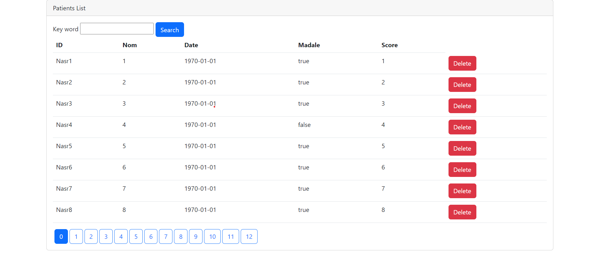

Une application Web JEE basée sur Spring MVC, Thylemeaf et Spring Data JPA qui permet de gérer les patients. L'application permettre les fonctionnalités suivantes :

-Afficher les patients

-Faire la pagination

-Chercher les patients

-Supprimer un patient

# **Thymeleaf** 
is a Java XML/XHTML/HTML5 template engine that can work both in web and non-web environments. It is better suited for serving XHTML/HTML5 at the view layer of MVC-based web applications, but it can process any XML file even in offline environments. It provides full Spring Framework integration.

# **JPA**

Jakarta Persistence API is a Jakarta EE application programming interface specification that describes the management of relational data in enterprise Java applications.